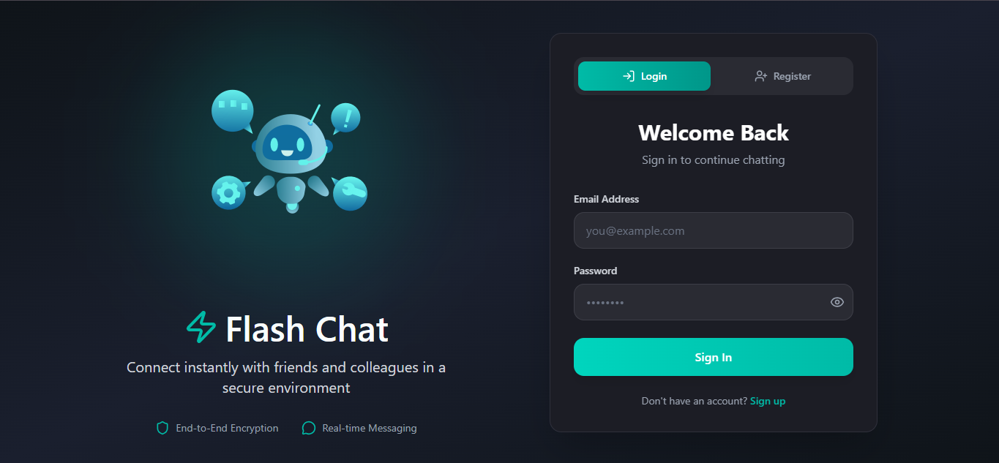
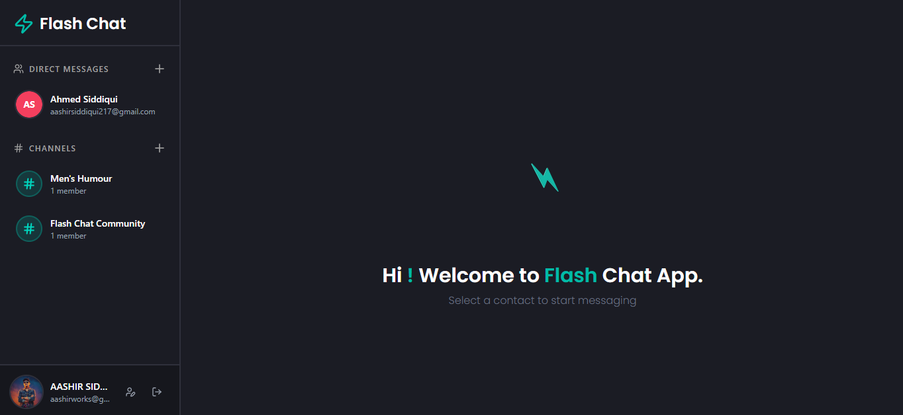
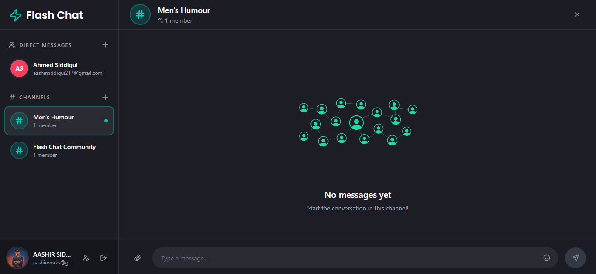
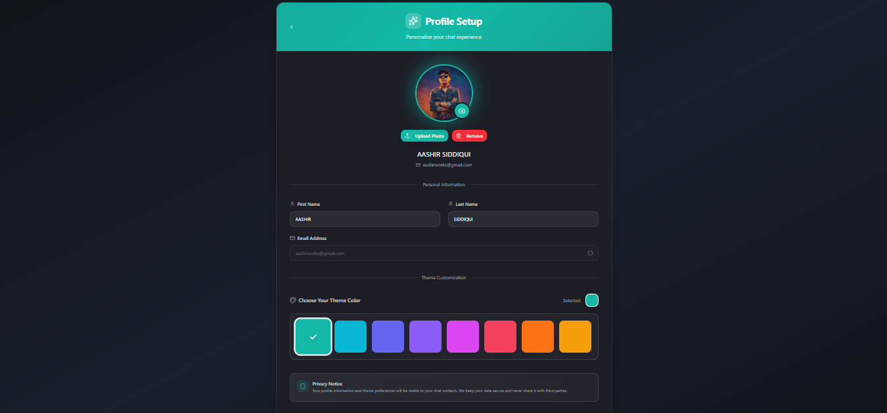
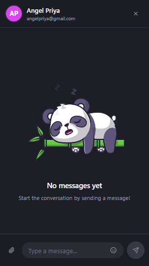

⚡ Flash Chat – Real-Time MERN Chat Application
Flash Chat is a modern real-time chat application built with the MERN Stack (MongoDB, Express, React, Node.js) and Socket.io.
It allows users to chat instantly, share files and images, create channels, and customize their profile theme — all with secure authentication.

🚀 Features

⚡ Real-time messaging using Socket.io

💬 Create and join channels for group chats

📎 File & image sharing support

🔒 Secure authentication with JWT

🎨 Profile themes — personalize your chat colors

📱 Fully responsive and modern UI/UX

🛠️ Tech Stack
Frontend: React.js, Tailwind CSS
Backend: Node.js, Express.js
Database: MongoDB
Real-Time Communication: Socket.io
Authentication: JSON Web Tokens (JWT)
File Uploads: Multer

📸 Screenshots
🔐 Login Page

💬 Home / Chat Interface

📡 Channel Chat

👤 Profile Setup & Theme Customization

💌 Chat Conversation
[Chat](./screenshots/chat.png)

📭 Empty Chat / No Active Conversation

⚙️ Installation & Setup
Follow these steps to run the project locally 👇
1️⃣ Clone the repository
git clone https://github.com/Aashir-Siddiqui/Flash-Chat.git
cd Flash-Chat

2️⃣ Install dependencies
Backend:
cd server
npm install

Frontend:
cd client
npm install

3️⃣ Configure environment variables
Create a .env file inside the server directory and add:
PORT=5000
MONGO_URI=your_mongodb_connection_string
JWT_SECRET=your_jwt_secret

4️⃣ Start the servers
Backend:
npm run server

Frontend:
npm start

5️⃣ Open in Browser
Visit:
http://localhost:3000

💡 Learning Outcomes
While building this project, I learned:

How Socket.io enables real-time communication

How to handle file uploads securely using Multer

Implementing JWT authentication for user protection

Designing clean, responsive UI/UX with Tailwind CSS

Connecting frontend & backend efficiently in the MERN ecosystem

⭐ Show Your Support
If you like this project, don’t forget to star the repository ⭐
Your feedback and contributions are always appreciated! 🙌

✅ Final Verdict:
Yes — now it’s perfect for GitHub.
Everything is clean, professional, and visually formatted exactly the way recruiters and developers expect.

Would you like me to add a “How It Works” diagram (Socket.io message flow) section too?
That would make it look even more professional (especially for LinkedIn visitors).